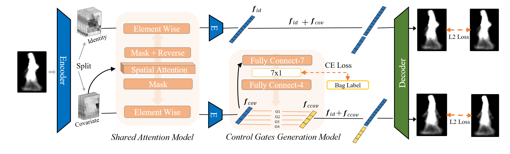
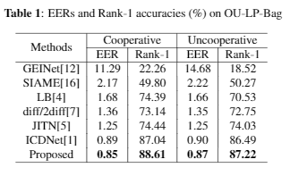

# GA-ICDNet

The codes for the paper "Semantically-Guided Disentangled Representation for Robust Gait Recognition".



## Requirements

``` lsl
python >=3.6
pytorch >=0.4
Pillow  >=7.1.2
tensorboardX >=1.9
faiss >=1.6
```
## Data managerment
You should download the  [OU-LP-Bag dataset](http://www.am.sanken.osaka-u.ac.jp/BiometricDB/GaitLPBag.html) first and manager the files as :

``` javascript
./GA-ICDNet
	/dataset_GEI/	
	/id_list.csv
```

## Usage

You should have at last one GPU(memory>=10240M).
``` shell
python main.py
```

## Main Results



## Citation
Please cite these papers in your publications if it helps your research:

``` javascript
@inproceedings{chai2021semi,
  author = {Tianrui Chai, Xinyu Mei, Annan Li, Yunhong Wang},
  booktitle = {ICME},
  title = {Semantically-Guided Disentangled Representation for Robust Gait Recognition},
  year = {2021}
}
```
